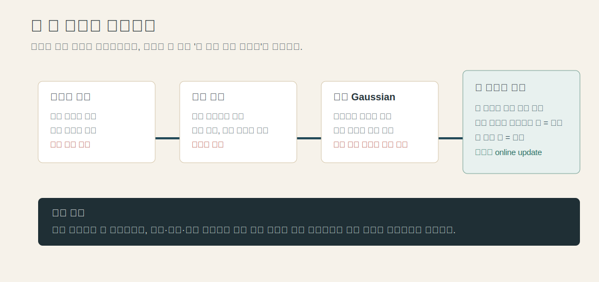
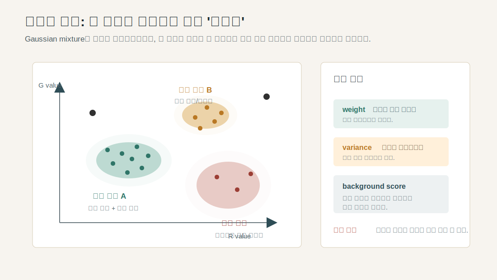
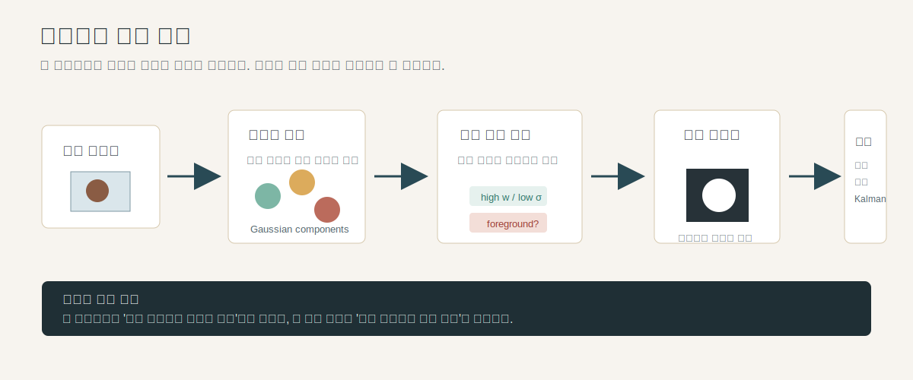

# Stauffer & Grimson 발표용 핵심 정리

대상 논문: Chris Stauffer, W. E. L. Grimson, *Adaptive Background Mixture Models for Real-Time Tracking*

이 문서는 세미나 발표에서 바로 사용할 수 있도록 논문의 논리를 네 부분으로 재구성한 것이다.

1. 문제 정의와 시대적 당위성
2. 해결 방법의 직관적 설명
3. 결과와 성과
4. 한계와 현대적 계보

---

## 0. 발표 전체 메시지

이 논문을 한 문장으로 말하면 다음과 같다.

> 배경은 한 장의 고정 이미지가 아니라, 각 픽셀이 시간 속에서 반복해서 보이는 여러 상태의 집합이다.

따라서 이 논문은 "현재 화면에서 움직이는 물체를 찾는다"보다 더 근본적인 문제를 푼다.

> 고정 카메라 영상에서, 시간이 지나며 변하는 현실 배경을 계속 학습하면서도, 새로 나타난 물체를 배경과 구분하는 방법은 무엇인가?

발표에서는 수식보다 이 관점의 전환을 먼저 잡는 것이 중요하다.

---

## 1. 문제 정의: 이 논문은 무엇을 문제로 보았나



### 1.1 겉으로 보이는 문제

감시 카메라나 교통 카메라에서 가장 먼저 필요한 일은 움직이는 물체를 배경에서 분리하는 것이다.

예를 들어 한 장면에 사람이 들어오면 시스템은 다음을 해야 한다.

- 배경 도로, 벽, 나무는 배경으로 둔다.
- 새로 들어온 사람이나 차는 전경으로 표시한다.
- 그 전경 영역을 시간에 따라 연결해서 추적한다.

전통적인 배경 제거는 단순하다.

```text
현재 프레임 - 배경 이미지 = 차이가 큰 곳을 전경으로 판단
```

하지만 실제 환경에서는 "배경 이미지"라는 것이 안정적으로 존재하지 않는다.

### 1.2 논문이 실제로 정의한 문제

이 논문이 정의한 문제는 다음과 같이 말할 수 있다.

> 현실의 배경은 계속 변한다. 그렇다면 시스템은 무엇을 배경으로 기억해야 하는가?

이 질문이 중요한 이유는 실제 영상에서 배경이 고정되어 있지 않기 때문이다.

- 햇빛과 그림자는 시간에 따라 변한다.
- 나뭇잎, 물결, 깃발은 배경이지만 계속 움직인다.
- 모니터 flicker나 반사광 때문에 같은 픽셀이 여러 색을 반복한다.
- 물체가 잠시 멈추면 전경이 배경처럼 보이기 시작한다.
- 물체가 사라지면 원래 배경을 빨리 복구해야 한다.

따라서 이 논문에서의 핵심 문제는 단순히 "움직이는 픽셀 찾기"가 아니다.

> 각 픽셀이 장기적으로 어떤 값들을 정상적인 배경 상태로 가져야 하는지, 실시간으로 학습하는 문제다.

### 1.3 왜 그 시대에 이 논문이 나와야 했나

이 논문이 나온 1990년대 말에는 실시간 영상 처리가 막 현실적인 연구 문제가 되던 시기였다. 컴퓨터 성능이 올라가면서, 연구자들은 더 이상 짧고 통제된 실험 영상만 볼 필요가 없었다. 실제 감시 환경처럼 장시간 돌아가는 시스템을 만들 수 있게 되었다.

그런데 시스템이 장시간 돌아가면 기존 방법의 약점이 바로 드러난다.

- 초기 배경을 한 번 저장하는 방식은 시간이 지나면 틀어진다.
- 단순 평균 배경은 느리게 움직이는 물체를 배경에 섞어버린다.
- 단일 Gaussian 모델은 한 픽셀이 여러 정상 상태를 갖는 상황을 설명하지 못한다.
- 전역 threshold는 밝은 영역과 어두운 영역에 같은 기준을 강요한다.

즉, 당시의 배경 제거 문제는 "계산이 가능해졌기 때문에 더 어려운 현실 조건을 정면으로 다뤄야 하는 단계"에 들어섰다.

이 논문의 당위성은 여기에 있다.

> 실시간이어야 하고, 장시간이어야 하며, 실외 환경이어야 한다. 그러려면 배경 모델 자체가 시간에 따라 적응해야 한다.

### 1.4 발표에서 써먹기 좋은 문제 정의 문장

발표 초반에는 다음 문장을 그대로 써도 된다.

> 이 논문은 배경 제거를 단순한 차영상 문제가 아니라, 시간에 따라 변하는 배경을 어떻게 기억하고 갱신할 것인가의 문제로 재정의했다.

또는 더 쉽게는 이렇게 말할 수 있다.

> 카메라가 보는 세상에서 배경은 가만히 있지 않는다. 이 논문은 그 움직이는 배경을 배경으로 인정하는 방법을 제안한다.

---

## 2. 방법: 수식보다 원리로 설명하기



### 2.1 기본 아이디어

논문의 핵심은 픽셀 하나를 독립적인 작은 관찰자로 보는 것이다.

예를 들어 영상의 어떤 한 픽셀이 있다고 하자. 그 픽셀은 매 프레임마다 색 값을 하나씩 본다. 오랜 시간 보면 그 픽셀에는 여러 패턴이 생긴다.

- 대부분의 시간에는 회색 도로 색이 보인다.
- 가끔 나무 그림자 때문에 어두운 색이 보인다.
- 가끔 자동차가 지나가며 빨간색이 보인다.
- 물결이나 반사 때문에 두세 가지 색이 반복될 수도 있다.

이 논문은 이 픽셀에게 "정상적으로 자주 보이는 색 후보 목록"을 여러 개 들고 있게 한다.

이 후보 하나하나가 Gaussian이다. Gaussian mixture는 어렵게 말하면 확률분포지만, 발표에서는 다음처럼 설명하는 편이 좋다.

> Gaussian 하나는 "이 픽셀에서 자주 보였던 색의 뭉치"다.  
> Gaussian mixture는 "그런 색 뭉치 여러 개를 동시에 기억하는 방식"이다.

### 2.2 왜 여러 개를 기억해야 하나

단일 배경값만 기억하면 다음 상황을 설명할 수 없다.

예를 들어 물가 장면에서 한 픽셀이 있다고 하자.

- 60%는 어두운 물 색
- 30%는 빛 반사 때문에 밝은 물 색
- 10%는 사람이 지나갈 때 옷 색

이때 평균 하나만 만들면 어두운 물도 아니고 밝은 반사도 아닌 애매한 색이 된다. 그러면 실제 배경이 나타나도 계속 전경처럼 오판할 수 있다.

Gaussian mixture는 이 문제를 피한다.

- 어두운 물 색을 후보 A로 저장한다.
- 밝은 반사 색을 후보 B로 저장한다.
- 지나가는 사람의 색은 오래 반복되지 않으면 배경 후보가 되지 못한다.

즉, 이 방법은 "배경이 하나일 것"이라는 가정을 버린다.

### 2.3 배경인지 아닌지는 어떻게 판단하나

판단 기준은 두 가지다.

첫째, 자주 보였는가.

자주 보인 색은 weight가 커진다. 배경은 대체로 오래, 반복해서 보이기 때문에 weight가 크다.

둘째, 안정적인가.

비슷한 값으로 좁게 모이면 variance가 작다. 흔들림이 심하거나 지나가는 물체처럼 값이 넓게 흩어지면 variance가 크다.

논문은 이 두 감각을 합쳐서 배경 후보를 고른다.

> 자주 보이고, 안정적으로 모이는 색일수록 배경일 가능성이 높다.

수식의 `w / sigma`는 발표에서 이렇게 풀면 된다.

- `w`: 이 색 후보가 얼마나 자주 나왔는가
- `sigma`: 이 색 후보가 얼마나 흔들리는가
- `w / sigma`: 자주 나오면서도 안정적인 정도

즉 `w / sigma`가 큰 후보부터 배경으로 인정한다.

### 2.4 새로운 픽셀값이 들어오면 무슨 일이 일어나나



매 프레임마다 각 픽셀은 다음 과정을 거친다.

1. 현재 픽셀값이 기존 후보 중 하나와 비슷한지 확인한다.
2. 비슷한 후보가 있으면 그 후보의 평균과 흔들림 정도를 조금 갱신한다.
3. 어떤 후보와도 비슷하지 않으면 새 후보를 만든다.
4. 자주 보이고 안정적인 후보들을 배경 목록으로 둔다.
5. 현재 픽셀값이 배경 목록에 없으면 전경으로 표시한다.

여기서 중요한 점은 "판단"과 "학습"이 동시에 일어난다는 것이다.

전통적인 방식은 배경을 먼저 만들고, 현재 프레임을 거기에 비교한다. 반면 이 논문은 매 프레임에서 비교하면서 동시에 배경 기억을 갱신한다.

발표에서는 다음 문장이 핵심이다.

> 이 알고리즘은 현재 프레임을 배경과 비교하는 동시에, 그 결과로 다음 프레임의 배경 기억을 수정한다.

### 2.5 `alpha`와 `T`의 직관

논문은 주요 파라미터를 두 개로 정리한다.

`alpha`는 기억의 속도다.

- 작으면 오래 기억한다.
- 크면 빨리 적응한다.
- 너무 작으면 조명 변화에 늦다.
- 너무 크면 잠깐 멈춘 물체도 배경으로 빨리 흡수된다.

`T`는 배경으로 인정할 후보의 폭이다.

- 낮으면 가장 강한 배경 후보만 인정한다.
- 높으면 나뭇잎, 물결, 그림자처럼 여러 반복 상태를 배경으로 인정한다.
- 너무 높으면 전경까지 배경에 들어갈 위험이 있다.

비전공자에게는 이렇게 설명하면 된다.

> `alpha`는 기억을 얼마나 빨리 고칠지 정하는 값이고, `T`는 배경의 다양성을 얼마나 넓게 인정할지 정하는 값이다.

---

## 3. 결과: 이 해결법은 무엇을 보여줬나

논문이 보여준 결과는 "정교한 벤치마크 점수"보다 "실시간 장기 운용 가능성"에 가깝다.

보고된 핵심 결과는 다음과 같다.

- `160x120` 영상에서 초당 11~13프레임 처리했다.
- 다섯 개 장면에서 16개월 이상 tracking 정보를 저장하며 운용했다.
- 비, 눈, 진눈깨비, 우박, 흐린 날, 맑은 날 등 다양한 실외 조건에서 동작했다고 보고했다.
- 빠른 구름 변화 같은 급격한 조명 변화가 생겨도 10~20초 정도 후 안정화된다고 설명했다.
- 10분짜리 장면에서 차량 33대와 사람 34명을 추적했다.
- 차량은 대부분 올바르게 분류했지만, 같은 지점에서 한 차가 나가고 다른 차가 들어오는 경우 하나의 객체로 보는 실패가 있었다.
- 두 사람이 붙어서 걷는 경우 한 사람으로 보는 실패도 있었다.

이 결과에서 발표자가 강조해야 할 것은 숫자 자체보다 다음이다.

> 이 논문은 배경 제거 모델을 연구실의 짧은 영상이 아니라, 장기간 실시간 감시 시스템의 구성 요소로 검증하려 했다.

그리고 결과의 설득력은 다음 세 가지에 있다.

첫째, 조명 변화에 적응한다.  
천천히 변하는 햇빛이나 day/night cycle에 모델이 따라간다.

둘째, 반복 배경을 견딘다.  
나뭇잎, 물결, 반사처럼 계속 바뀌지만 사실은 배경인 움직임을 여러 모드로 받아들인다.

셋째, 배경 복구가 빠르다.  
정지한 물체가 잠시 배경처럼 편입되어도, 원래 배경 후보가 mixture 안에 남아 있으면 물체가 사라진 뒤 빠르게 회복된다.

---

## 4. 한계와 현대적 계보

### 4.1 이 논문의 한계

이 논문은 강력한 고전이지만, 오늘날 관점에서는 한계도 명확하다.

첫째, 픽셀을 독립적으로 본다.  
각 픽셀의 색 변화만 보므로 주변 픽셀과의 형태, 경계, 물체 구조를 직접 이해하지 못한다.

둘째, 의미를 모른다.  
사람, 차, 그림자, 반사, 나뭇잎을 개념적으로 구분하는 것이 아니라, 색값의 반복성과 안정성으로만 판단한다.

셋째, 그림자 처리가 약하다.  
논문은 그림자를 제거하기보다 함께 추적하는 쪽을 선택한다. 당시 감시 목적에서는 어두운 물체를 놓치지 않는 것이 더 중요했지만, 정확한 객체 마스크가 필요한 응용에는 한계다.

넷째, 급격한 변화에 취약하다.  
갑자기 조명이 바뀌거나 카메라가 흔들리면 기존 배경 후보가 한꺼번에 틀어질 수 있다.

다섯째, 객체 겹침은 별도 추적기의 문제로 남는다.  
두 사람이 붙거나 차량이 같은 위치에서 교차하면 connected component와 tracking이 혼동된다.

여섯째, 현대 기준의 정량 평가가 부족하다.  
공개 데이터셋 기반 precision, recall, F-measure 비교나 ablation study가 충분하지 않다. 대신 장기 운용 사례로 설득한다.

### 4.2 이후 어떤 연구의 기반이 되었나

이 논문은 이후 background subtraction 연구에서 "픽셀별 background model"의 대표적 출발점이 되었다. 현대적 발전은 크게 네 방향으로 볼 수 있다.

#### 방향 1. 더 정교한 Gaussian mixture 계열

Stauffer & Grimson의 아이디어는 이후 적응형 GMM, MOG2 같은 형태로 계속 쓰였다. OpenCV의 `BackgroundSubtractorMOG2`도 Gaussian mixture 기반 foreground/background segmentation으로 제공되며, component 수, learning rate, shadow detection 같은 설정을 포함한다.

발표식으로 정리하면 다음과 같다.

> 원 논문이 "픽셀마다 여러 배경 후보를 둔다"는 틀을 만들었다면, 후속 GMM 계열은 그 후보 수, 업데이트 방식, 그림자 처리, 계산량 제어를 개선했다.

#### 방향 2. 비모수·샘플 기반 배경 모델

Gaussian 모양을 가정하지 않고, 픽셀이 과거에 본 샘플들을 직접 저장하는 방식도 발전했다. 이런 계열은 "색값 분포가 꼭 종 모양일 필요는 없다"는 문제의식에서 출발한다.

이 방향의 핵심은 다음이다.

> 분포를 수식으로 가정하기보다, 실제로 관측된 배경 샘플 집합을 들고 있다가 현재 픽셀과 비교한다.

#### 방향 3. 저랭크·희소 분해 계열

Robust PCA 계열은 영상을 행렬로 보고, 배경은 반복적으로 나타나는 저랭크 성분, 움직이는 객체는 드문 희소 성분으로 분해한다.

직관적으로는 다음과 같다.

> 여러 프레임에 계속 깔려 있는 공통 구조는 배경이고, 일부 프레임과 일부 위치에만 튀어나오는 변화는 전경이다.

이 접근은 픽셀별 모델보다 전체 영상의 구조를 더 강하게 활용한다.

#### 방향 4. 딥러닝 기반 foreground segmentation

최근에는 CNN, encoder-decoder, U-Net 계열 구조를 이용해 foreground mask를 직접 예측하는 방식이 강해졌다. 딥러닝 계열은 픽셀 색값뿐 아니라 주변 문맥, 물체 형태, 장면 의미를 함께 학습할 수 있다.

다만 이 흐름도 원래 문제는 같다.

> 현재 프레임에서 무엇이 배경이고 무엇이 전경인가?

차이는 "각 픽셀의 색 통계"로 풀던 문제를, 이제는 "영상 문맥과 학습된 특징"으로 푼다는 점이다.

### 4.3 현대 관점에서 이 논문의 위치

현대적으로 보면 이 논문은 최종 해법이라기보다 문제 정의의 기준점이다.

이 논문이 남긴 핵심 유산은 다음 세 가지다.

1. 배경은 고정 이미지가 아니라 시간적으로 학습되는 모델이라는 관점
2. 같은 픽셀에도 여러 정상 상태가 있을 수 있다는 다중 모드 배경 개념
3. 분류와 업데이트를 동시에 수행하는 online background modeling 구조

따라서 한계 발표는 단순히 "오래된 방법이라 부족하다"로 끝내면 안 된다. 더 정확한 평가는 다음이다.

> 이 논문은 현대적인 의미 인식이나 딥러닝은 없지만, 배경 제거 문제를 장기 실시간 학습 문제로 정식화했다는 점에서 이후 연구의 기본 언어를 만들었다.

---

## 5. 발표 슬라이드 구성안

### Slide 1. 제목

**Adaptive Background Mixture Models for Real-Time Tracking**

부제: 배경은 한 장의 이미지가 아니라 시간 속에서 학습되는 분포다.

### Slide 2. 왜 어려운가

한 장의 배경 이미지를 빼는 방식의 직관을 보여준다.

말할 포인트:

- 고정 카메라라도 배경은 고정되어 있지 않다.
- 조명, 그림자, 물결, 나뭇잎, 반사 때문에 배경 자체가 움직인다.
- 따라서 "움직임 = 전경"이라는 단순 가정이 깨진다.

사용 자료: `seminar_problem_timeline.svg`

### Slide 3. 논문의 문제 정의

핵심 질문:

> 변화하는 현실 배경을 계속 학습하면서, 새로 들어온 객체만 전경으로 분리할 수 있는가?

강조:

- 실시간
- 장시간
- 실외 환경
- 사람 개입 없는 적응

### Slide 4. 기존 방식의 한계

표 형태로 정리한다.

| 기존 방식 | 장점 | 한계 |
| --- | --- | --- |
| 초기 배경 저장 | 단순함 | 시간이 지나면 틀어짐 |
| 시간 평균 | 천천히 적응 | 느린 물체와 반복 배경에 약함 |
| 단일 Gaussian | 픽셀별 threshold 가능 | 한 픽셀의 여러 정상 상태를 설명 못함 |

### Slide 5. 핵심 아이디어

> 한 픽셀에 배경 후보를 여러 개 둔다.

사용 자료: `seminar_gmm_intuition.svg`

말할 포인트:

- Gaussian 하나 = 자주 보인 색의 덩어리
- mixture = 그 덩어리 여러 개의 목록
- 자주 보이고 안정적인 덩어리 = 배경
- 드물거나 불안정한 덩어리 = 전경 후보

### Slide 6. 알고리즘 흐름

사용 자료: `seminar_method_pipeline.svg`

말할 포인트:

- 현재 픽셀값을 기존 후보들과 비교한다.
- 맞는 후보가 있으면 조금 업데이트한다.
- 안 맞으면 새 후보를 만든다.
- 배경 후보에 속하지 않으면 전경으로 분류한다.
- 이 과정을 모든 픽셀에서 매 프레임 수행한다.

### Slide 7. 파라미터 직관

`alpha`: 기억을 얼마나 빨리 고칠 것인가  
`T`: 배경의 다양성을 얼마나 넓게 인정할 것인가  
`K`: 한 픽셀이 기억할 후보의 최대 개수

발표 문장:

> `alpha`는 시간에 대한 민감도이고, `T`는 배경으로 인정하는 폭이다.

### Slide 8. 결과

핵심:

- `160x120`에서 11~13fps
- 16개월 장기 운용
- 실외 날씨 변화에서 작동
- 차량/사람 추적 및 간단한 분류 가능

해석:

> 이 논문의 성과는 최고 정확도보다 장시간 실시간 운용 가능성을 보였다는 데 있다.

### Slide 9. 실패 사례와 한계

강조:

- 급격한 조명 변화
- 그림자
- 객체 겹침
- 픽셀 독립 가정
- 의미 이해 부재
- 현대 기준 정량 평가 부족

### Slide 10. 이후 연구로의 연결

네 흐름:

- 개선된 GMM / MOG2
- 샘플 기반 비모수 배경 모델
- Robust PCA / 저랭크-희소 분해
- CNN / encoder-decoder / semantic background subtraction

마무리 문장:

> 이 논문은 완성된 최종 모델이라기보다, 배경 제거를 online background modeling 문제로 만든 출발점이다.

---

## 6. 발표자가 기억할 핵심 문장 5개

1. 이 논문은 배경 제거를 차영상 문제가 아니라 배경 기억을 갱신하는 문제로 바꾸었다.
2. 현실의 배경은 하나의 색이 아니라 여러 반복 상태를 갖는다.
3. Gaussian mixture는 한 픽셀이 과거에 자주 본 색 후보들을 여러 개 저장하는 장치다.
4. 자주 보이고 안정적인 후보는 배경, 그렇지 않은 값은 전경으로 본다.
5. 현대 딥러닝 방법은 이 문제를 더 풍부한 문맥과 의미 정보로 풀지만, 문제의 기본 구조는 이 논문이 정식화한 background/foreground separation 위에 있다.

---

## 7. 참고 연결

- 원 논문 PDF: `Adaptive_background_mixture_models_for_real-time_tracking.pdf`
- OpenCV `BackgroundSubtractorMOG2`: Gaussian mixture 기반 background/foreground segmentation 구현과 파라미터 설명
- Candès et al., *Robust Principal Component Analysis?*: 배경/전경을 저랭크-희소 분해로 보는 계열의 대표 논문
- Bouwmans et al., *Deep Neural Network Concepts for Background Subtraction*: 딥러닝 기반 background subtraction 흐름을 정리한 survey
- Lim & Keles, *Foreground Segmentation Using a Triplet Convolutional Neural Network for Multiscale Feature Encoding*: CNN 기반 foreground segmentation 사례
